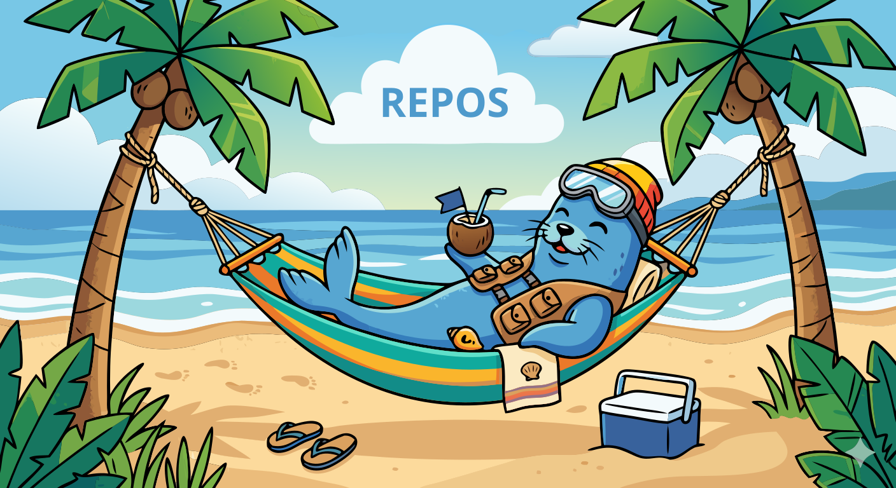

# REPOS
<p align="center">
  
</p>
Modulare Build-Orchestrierung fuer Container-Stacks.

## Quickstart

```bash
# 1. Shared base image bauen (einmalig, alle Packages)
python3 build.py --build-base

# 2. Stack konfigurieren + generieren
python3 configure.py

# 3. Stack bauen und starten
generated/<stack>/<stack>_build.sh
generated/<stack>/<stack>_run.sh
```

## Build-Modi

### Shared Base Image (empfohlen)

```bash
python3 build.py --build-base
```

Sammelt **alle** `requirements.toml` aus allen Modulen und baut ein einzelnes
`localhost/repos-base:latest` Image mit allen dnf/pip/npm Packages.
Keine Config noetig.

Danach erkennt `build.py` automatisch ob `repos-base:latest` existiert:
- **Ja** -> Stack-Overlay ohne Package-Installs (schnell, nur COPY-Layer)
- **Nein** -> Voller Build wie bisher (alle Packages im Overlay)

| Aenderung | Was neu bauen |
|-----------|---------------|
| App-Code (Repos) | Nur den Stack |
| Config / Supervisord | Nur den Stack |
| Neues Package (dnf/pip/npm) | Base + betroffene Stacks |
| Neues Modul mit Requirements | Base + betroffene Stacks |
| Fedora-Version bump | Base + alle Stacks |

### Klassischer Build (ohne Base)

Ohne `--build-base` und ohne vorhandenes Base-Image funktioniert alles wie
bisher -- alle Packages werden direkt im Stack-Image installiert.

## Modulstruktur

Module werden **dynamisch** aus diesen Ordnern geladen:

- `MODULES/PUBLIC`
- `MODULES/PRIVATE`
- `MODULES/3RDPARTY`
- `MODULES/3RDPARTY_DEPENDENCIES`

Abfrage-Blacklist ist konfigurierbar in `general.toml`:
- `[modules].exclude = "3RDPARTY_DEPENDENCIES, ..."` (comma-separated)
- betrifft nur die direkte Abfrage in `configure.py`
- Dependencies werden trotzdem automatisch aufgeloest

Jedes Modul liegt als eigener Ordner vor, z. B.:

- `MODULES/PUBLIC/citadel/module.toml`
- `MODULES/PUBLIC/citadel/dependencies.toml`
- `MODULES/PUBLIC/codeanalyst/runtime.toml`
- `MODULES/PUBLIC/codeanalyst/env.toml`
- `MODULES/PUBLIC/napoleon/vol.toml`

Zielstruktur pro Modul:
- `module.toml` (Basisdaten)
- `dependencies.toml` (auto-select)
- `env.toml` (Env-Prompts mit Fallunterscheidung)
- `runtime.toml` (Supervisor-Programme)
- `requirements.toml` (optional: pip/dnf/npm_global)
- `vol.toml` (Named-Volume-Pfade)

## Defaults (modular)

Globale Defaults werden aus `DEFAULTS/*.toml` geladen (alphabetisch, spaetere
Dateien ueberschreiben fruehere), z. B.:

- `DEFAULTS/10-naming.toml` (`[naming].adjectives`, `[naming].animals`)
- `DEFAULTS/20-configure.toml` (`[configure].container_prefix`, `image_registry`, `network`, `include_thirdparty`)
- `DEFAULTS/30-litellm-ports.toml` (`[litellm]`)

## general.toml

Zentrale Konfiguration auf Root-Ebene:

```toml
[build]
base_image = "quay.io/fedora/fedora:43"    # Basis fuer --build-base

[modules]
exclude = "3RDPARTY_DEPENDENCIES"

[volumes]
paths = ["/etc/supervisor/conf.d"]
```

## Module

`citadel` ist ein normales Public-Modul, bringt aber Abhaengigkeiten mit:
- `caddy`
- `php-fpm`

`tailscale` kann als 3rd-party Feature gewaehlt werden.

`litellm` ist als `3RDPARTY_DEPENDENCIES`-Modul gefuehrt und wird nur ueber
Dependencies aktiviert (z. B. durch `napoleon` und `pvdach`).

Auto-Dependencies werden direkt bei der Modulauswahl angezeigt und im spaeteren
3rd-party-Block nicht erneut abgefragt.
Module unter `3RDPARTY_DEPENDENCIES` werden nie einzeln abgefragt, sondern nur
automatisch ueber `dependencies.toml` aktiviert (z. B. `litellm`, `caddy`, `php-fpm`).

Wenn LiteLLM-relevante Module aktiv sind, fragt `configure.py` nach
`sdk/proxy`:
- `proxy`: nur URL + Key
- `sdk`: lokaler LiteLLM + Provider-Key-Liste (dynamisch aus `MODULES/3RDPARTY_DEPENDENCIES/litellm/env.toml`)

`DEFAULT_MODEL` wird aus einer zentralen Modell-Liste geladen (`DEFAULTS/30-litellm-ports.toml`);
Modelle aus Dependency-Modulen werden dabei zuerst priorisiert angezeigt.

`openclaw`, `codex-cli`, `hermes`, `claude-code` werden unter `/root/<name>`
abgelegt; Persistenz kommt ueber `vol.toml` (`/root` als Named Volume).
Install-Requirements kommen modular aus `requirements.toml`:
- `openclaw`, `codex-cli`, `claude-code` via `npm_global`
- `hermes` via `pip`

Runtime via Supervisor:
- `openclaw` und `hermes` haben Modul-`runtime.toml` und erzeugen eigene
  `conf.d`-Eintraege.
- `codex-cli` und `claude-code` haben keine Runtime-Services (nur Tools im Image).

## Supervisor-Logik

- Runtime-Programme pro gewaehltem Repo kommen aus dessen `runtime.toml`.
- Daraus werden einzelne Dateien unter `generated/<stack>/supervisord/zz-module-*.conf` erzeugt.
- Diese werden beim Build in `/etc/supervisor/conf.d/` integriert.

## Usage

```bash
python3 configure.py
```

`configure.py` schreibt `selected_modules` und `forced_modules` direkt in die
Konfigurationsdatei unter `CONFIGS/<stack>.toml` und ruft anschliessend den
Generate-Flow (`--generate-only`) auf.

Am Ende von `configure.py` kommt eine finale Persistenz-Abfrage (nach allen
Auto-Dependencies):
- `persist_root`
- `persist_napoleon_opt`
- `persist_tailscale_state`

Diese Werte landen im Stack-Config-TOML und zusaetzlich in `./general.toml`
auf REPOS-Root-Ebene als allgemeine Defaults (inkl. `[volumes]` auf `./`-Ebene).

Optional:

```bash
python3 configure.py --load CONFIGS/<stack>.toml
python3 configure.py --save CONFIGS/custom.toml
python3 build.py --build-base                          # Shared base image
python3 build.py --config CONFIGS/<stack>.toml          # Stack bauen
python3 build.py --config CONFIGS/<stack>.toml --dry-run # Nur anzeigen
generated/<stack>/<stack>_build.sh
generated/<stack>/<stack>_run.sh
```

## Generierte Dateien

Pro Stack unter `generated/<stack>/`:
- `<stack>.overlay.Dockerfile` -- Overlay auf Base-Image
- `<stack>_build.sh` -- Build-Script
- `<stack>_run.sh` -- Run-Script
- `<stack>.env` -- Environment-Variablen
- `<stack>.container` -- Quadlet/Systemd Container-Definition
- `meta.json` -- Build-Metadaten
